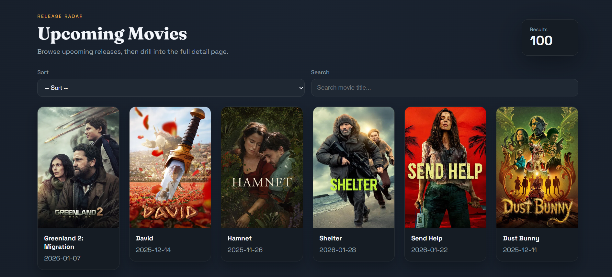
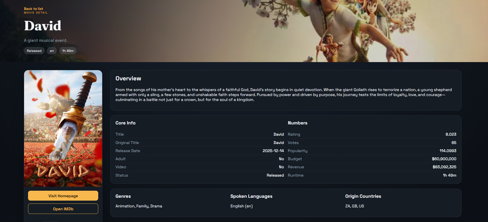

# Movie Upcoming

A React + Vite app that lists upcoming movies from TMDB, with search and sorting, plus a detailed movie page.

## Screenshots




## Features

- Upcoming movies list with posters and release dates
- Search by title and sort by title or release date
- Detail view with overview, stats, production data, and links

## Tech Stack

- React 19
- React Router 7
- Vite 7
- TMDB API

## Requirements

- Node.js 18+ (recommended)
- TMDB API token

## Setup

1. Install dependencies:

   ```bash
   npm install
   ```

2. Create a `.env` file in the project root:

   ```bash
   VITE_TMDB_BEARER_TOKEN=your_tmdb_bearer_token
   ```

   The token can be either the raw token or prefixed with `Bearer `.

3. Run the app:

   ```bash
   npm run dev
   ```

4. Build for production:

   ```bash
   npm run build
   ```

5. Preview the production build:

   ```bash
   npm run preview
   ```

## Project Structure

- [src/App.jsx](src/App.jsx) - list page: fetch, search, and sort
- [src/MovieDetail.jsx](src/MovieDetail.jsx) - detail page
- [src/main.jsx](src/main.jsx) - router setup
- [src/index.css](src/index.css) - global styles and theme

## Notes

- Both list and detail views use the TMDB bearer token from `.env`.

## Deploy

### Vercel

1. Import the repository.
2. Set environment variable `VITE_TMDB_BEARER_TOKEN`.
3. Build command: `npm run build`
4. Output directory: `dist`

### Netlify

1. Import the repository.
2. Set environment variable `VITE_TMDB_BEARER_TOKEN`.
3. Build command: `npm run build`
4. Publish directory: `dist`

## Credits

- Data and images are provided by [TMDB](https://www.themoviedb.org/).
